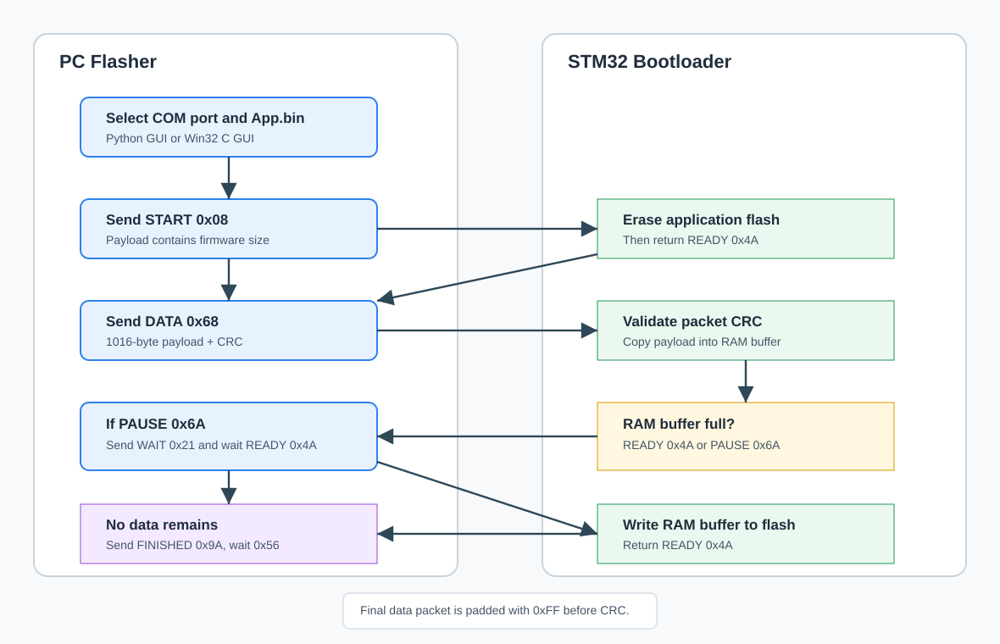

# STM32G474 Flash USART Bootloader

โปรเจกต์นี้เป็นตัวอย่าง bootloader สำหรับ STM32G474 ที่รับ firmware ผ่าน USART/LPUART ด้วย packet ขนาด 1024 bytes แล้วเขียน application ลง flash เริ่มที่ `0x08003000`

มี PC flasher ให้ใช้งาน 2 แบบ:

- `Flash_program/Flash_program_V1.py` เป็น Python Tkinter GUI
- `Flash_program_C/Flash_program_C.exe` เป็น Win32 C GUI

## Workflow



## Project Structure

```text
App/                 Application firmware source
BPS/                 Bootloader peripheral/service source
datasheet/           STM32G474 documents
Flash_program/       Python GUI firmware flasher
Flash_program_C/     Win32 C GUI firmware flasher
libraries/           STM32G4/CMSIS libraries
MDK_App/             Keil project and build output for application
MDK_Bootloader/      Keil project and build output for bootloader
docs/                Project documentation images
```

## Protocol Summary

| Direction | Command | Value | Meaning |
|---|---:|---:|---|
| PC to STM32 | `START` | `0x08` | Begin update and send firmware size |
| PC to STM32 | `SENDING` | `0x68` | Send one 1016-byte payload packet |
| PC to STM32 | `WAIT` | `0x21` | Tell STM32 to write its RAM buffer to flash |
| PC to STM32 | `FINISHED` | `0x9A` | No firmware data remains |
| STM32 to PC | `READY` | `0x4A` | Ready for next packet |
| STM32 to PC | `PAUSE` | `0x6A` | RAM buffer is full; PC must send `WAIT` |
| STM32 to PC | `FINISHED_ACK` | `0x56` | Flash update completed |

Packet layout:

```text
Header 4 bytes + Payload 1016 bytes + CRC 4 bytes = 1024 bytes
```

The payload of the final data packet is padded with `0xFF`.

## Python GUI Flasher

Requirements file:

```text
Flash_program/requirements.txt
```

Install and run without auto-activating the venv:

```powershell
cd C:\Users\Knnn\Desktop\STM32G474_Flash_USART\Flash_program
python -m venv .venv
.\.venv\Scripts\python.exe -m pip install -r requirements.txt
.\.venv\Scripts\python.exe .\Flash_program_V1.py
```

Usage:

1. Connect STM32 and enter bootloader mode.
2. Select the COM port.
3. Select `App.bin`.
4. Click `Start Flash`.
5. Wait until the log shows success.

## Win32 C GUI Flasher

Requirements file:

```text
Flash_program_C/requirements.txt
```

If `Flash_program_C.exe` already exists:

```powershell
cd C:\Users\Knnn\Desktop\STM32G474_Flash_USART\Flash_program_C
.\Flash_program_C.exe
```

To build with MSYS2 UCRT64:

```powershell
$env:Path = "C:\msys64\ucrt64\bin;$env:Path"
cd C:\Users\Knnn\Desktop\STM32G474_Flash_USART\Flash_program_C
.\build_mingw.bat
.\Flash_program_C.exe
```

If GCC fails with an empty compiler output, update MSYS2 fully from **MSYS2 UCRT64**:

```bash
pacman -Syu
pacman -Syu
pacman -S --needed base-devel mingw-w64-ucrt-x86_64-toolchain
```

## Bootloader Notes

- Application flash starts at `FLASH_START_APP1 = 0x08003000`.
- The bootloader erases the application area before receiving new firmware.
- STM32 writes flash only after receiving `WAIT (0x21)` or `FINISHED (0x9A)`.
- The PC flasher must wait for `READY (0x4A)` before sending `FINISHED (0x9A)` when STM32 reports `PAUSE (0x6A)`.

## Build Outputs

Typical files used by the flasher:

```text
Flash_program/App.bin
Flash_program_C/Flash_program_C.exe
```

Generated Keil build outputs are under:

```text
MDK_App/Objects/
MDK_Bootloader/Objects/
```
